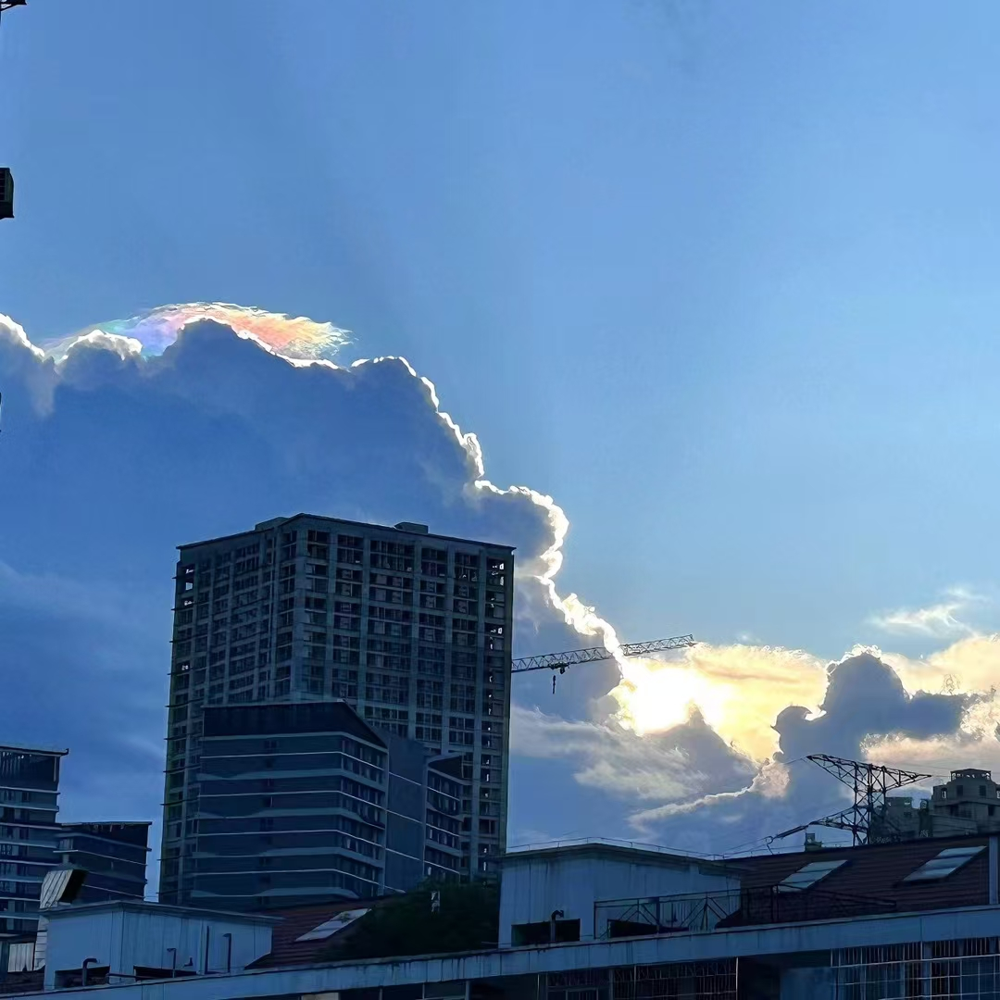

<h1>欢迎来到我的主页!</h1>
风吹到了少女从未想过的地方~~~
<h3 >🧑‍💻我的技术栈 </h3>

    他们都在假装不思进取，你别上当

  
    
  
  
  
  
  
  
  
  
  
  
  
  
  
  
  
  

<h3>🔥 我的文章</h3>

    你看，这里藏着点好东西，不点进去瞧瞧，可能错过了什么精彩哦~

    
        <a href="https://bytequestor.github.io" target="_blank" style="font-family: 'Comic Sans MS', cursive;">这儿有颜值在线的！不来看看嘛？</a>
    

<h3>🎁 项目</h3>
<table>
  <thead align="center">
    <tr border: none;>
  <tbody>
    <tr> 
      <td><b>电子设计大赛</b></td>
      <td></td>
      <td></td>
      <td></td>
      <td></td>
    </tr>

<tr> 
      <td><a href="http://124.70.26.87/monopoly/"><b>大富翁游戏</b></a></td>
      <td></td>
      <td></td>
      <td></td>
      <td></td>
    </tr>

  </tbody>
</table>
 

<h3>加入我</h3>

   

<h1 style="text-align: center;">1988年1月24日</h1>

